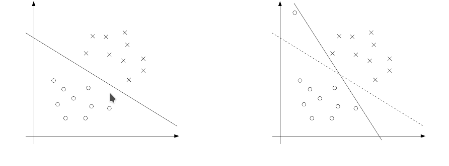

## 生成学习算法

之前我们是对$p(y|(x,\tau))\backsim D(\tau(x))$ 进行建模。就是要预测$y$在不同类别上的概率分布，进而确定$y$的种类。

现在我们换一种思路，利用贝叶斯的后验概率。在一个学校男的都穿裤子，女的一半穿裤子，一半穿裙子。如果我们有男女比例的数据，例如男:女＝6:4。那么我只看下半身发现对面的同学穿了裤子，那他是男的还是女的呢？也就是我们先认识一下不同类的分布的自身属性，在反过来研究我们要预测的对象。我们用这种思路重新审视这个问题。在分类问题中，我们的样本给我们提供了一个男女的比率数据，但是这个数据的真实性（即能不能代表全样本空间的分布）可能不会太好（例如有隔壁学校蹭课的同学，被你看见了）。

### GDA(连续特征)

分布的假设：

$\Omega=\Omega_1+\Omega_2+...+\Omega_k,\Omega_i\cap\Omega_j=\emptyset(i\ne j)$

#### 1 $y\backsim Bernoulli(\phi)$

#### 2 $x|y\in \Omega_i \backsim N(\mu_i,\Sigma)$ 

$p(y)=\prod_{i=1}^{i=k}\phi_i^{is(y\in\Omega_i)}$

$f(x|y\in\Omega_i)=\frac{1}{(2\pi)^{\frac{n}{2}}|\Sigma|^{\frac{1}{2}}}e^{-\frac{1}{2}(x-\mu_i)^T\Sigma^{-1}(x-\mu_i)}$

$f(x|y)=\prod_{i=1}^{i=k}(\frac{1}{(2\pi)^{\frac{n}{2}}|\Sigma|^{\frac{1}{2}}}e^{-\frac{1}{2}(x-\mu_i)^T\Sigma^{-1}(x-\mu_i)})^{is(y\in\Omega_i)}$

由条件概率公式：

$p(y|x)=\frac{p(x|y)p(y)}{p(x)}$

由全概率公式：

$p(x)=\sum_{i=1}^{i=k}p(y\in\Omega_i)f(x|y\in\Omega_i)=\sum_{i=1}^{i=k}\phi_i\frac{1}{(2\pi)^{\frac{n}{2}}|\Sigma|^{\frac{1}{2}}}e^{-\frac{1}{2}(x-\mu_i)^T\Sigma^{-1}(x-\mu_i)}$

得到贝叶斯公式：

$p(y\in\Omega_i|x)=\frac{p(x|y\in\Omega_i)p(y\in\Omega_i)}{\sum_{i=1}^{i=k}p(y\in\Omega_i)p(x|y\in\Omega_i)}$

可以看出我们对于一个给的样本属性$x$判断它的分类的时候一定是挑在$x$发生下所有分类贡献中最大的那一个。即$p(x|y\in\Omega_i)p(y\in\Omega_i)$最大对应的分类(原文中的想法),但是$p(x)$本身也是$\phi,\mu,\Sigma$函数。

这个时候$L(\phi,\mu_1,..,\mu_k,\Sigma)=\prod_{i=1}^{i=m}p(y^i\and x^i)=\prod_{i=1}^{i=m}p(x^i|y^i)p(y^i)$,$l(\phi,\mu_1,..,\mu_k,\Sigma)=\sum_{i=1}^{i=m}(\ln(p(x^i|y^i))+\ln p(y^i)$

$ln(y)=\sum_{i=1}^{i=k}{is(y\in\Omega_i)ln(\phi_i)}$

$\ln p(x|y)=\sum_{i=1}^{i=k}{is(y\in\Omega_i)ln(\frac{1}{(2\pi)^{\frac{n}{2}}|\Sigma|^{\frac{1}{2}}}e^{-\frac{1}{2}(x-\mu_i)^T\Sigma^{-1}(x-\mu_i)})}$

$l(\phi,\mu_1,..,\mu_k,\Sigma)=\sum_{j=1}^{j=m}\sum_{i=1}^{i=k}{is(y^j\in\Omega_i)(ln(\frac{1}{(2\pi)^{\frac{n}{2}}|\Sigma|^{\frac{1}{2}}}e^{-\frac{1}{2}(x-\mu_i)^T\Sigma^{-1}(x-\mu_i)})}+\sum_{j=1}^{j=m}(\sum_{i=1}^{i=k-1}is(y^j\in\Omega_i)\ln\phi_i+is(y^j\in\Omega_k)\ln(1-\sum_{l=1}^{l=k-1}\phi_l))$

#### 1  $\phi$

$\frac{\partial l}{\partial \phi_i}=\sum_{j=1}^{j=m}(\sum_{i=1}^{i=k-1}is(y^j\in\Omega_i)\frac{1}{\phi_i}-is(y^j\in\Omega_k)\frac{1}{1-\sum_{l=1}^{l=k-1}\phi_l})=0$

即选择的$m$个样本中属于不同分类的个数分别为$m_1,m_2,...,m_k,m_i\ge0, \sum m_i=m$

上式等价于$\frac{m_i}{\phi_i}=\frac{m_k}{\phi_k},i=1,2,..,k$

由比例式形式$\phi_i=\frac{m_i}{m},i=1,2,...,k$

#### 2 $\mu_i$

$\frac{\partial l}{\partial \mu_i }=\frac{\sum_{j=1}^{j=m}\sum_{i=1}^{i=k}{is(y^j\in\Omega_i)\partial (-\frac{1}{2}(x^j-\mu_i)^T\Sigma^{-1}(x^j-\mu_i))}}{\partial \mu_i}=\sum_{j=1}^{j=m}\sum_{i=1}^{i=k}is(y^j\in\Omega_i)\Sigma^{-1}(x^j-\mu_i)=0$

$\Sigma^{-1}\sum_{j=1}^{j=m}\sum_{i=1}^{i=k}is(y^j\in\Omega_i)(x^j-\mu_i)=\Sigma^{-1}(\sum_{j=1}^{j=m}\sum_{i=1}^{i=k}is(y^j\in\Omega_i)x^j-m_i\mu_i)=0$

$\Sigma$正定,则$\mu_i=\frac{\sum_{j=1}^{j=m}\sum_{i=1}^{i=k}is(y^j\in\Omega_i)x^j}{m_i}$。

#### 3 $\Sigma$

[matrix calculus](http://www.psi.toronto.edu/matrix/calculus.html)

$\frac{d (ln\det(X^k))}{dX}=kX^{-T}$

$\frac{d (a^TXb)}{dX}=ab^T$

$\frac{\partial l}{\partial \Sigma}=-\frac{\sum_{j=1}^{j=m}\sum_{i=1}^{i=k} is(y^j\in\Omega_i)\partial\ln(2\pi)^{\frac{n}{2}} |\Sigma|^{\frac{1}{2}}}{\partial \Sigma}-\frac{1}{2}\frac{\sum_{j=1}^{j=m}\sum_{i=1}^{i=k} is(y^j\in\Omega_i)\partial (x^j-u_i)^T\Sigma^{-1}(x^j-u_i)}{\partial \Sigma}=0$

$-\sum_{j=1}^{j=m}\sum_{i=1}^{i=k} is(y^j\in\Omega_i)\frac{1}{2}  \Sigma^{-1}+\Sigma^{-2}\frac{1}{2}\sum_{j=1}^{j=m}\sum_{i=1}^{i=k} is(y^j\in\Omega_i)(x^j-u_i)(x^j-u_i)^T=0$

$m\Sigma^{-1}=\Sigma^{-2}\sum_{j=1}^{j=m}\sum_{i=1}^{i=k} is(y^j\in\Omega_i)(x^j-u_i)(x^j-u_i)^T$

$\Sigma=\frac{\sum_{j=1}^{j=m}\sum_{i=1}^{i=k} is(y^j\in\Omega_i)(x^j-u_i)(x^j-u_i)^T}{m}$

#### 4 $Hessian(l)$半正定

### GDA模型的物理意义和缺陷

根据上述方法，我们可以得出不同分类本身的分布属性，对于给定的一个预测样本$\{x,y\}$,根据贝叶斯的后验概率原理，我们只需要将造成$x$发生可能性最大的分类$y$为其预测结果即可。也就是发现一个同学穿裤子，男女比例$6:4$ ,穿裤子男女比例$6:2$,显然觉得看见的同学是一个男生比较靠谱。

$GDA$需要样本在不同分类上的特征都能表达为一个多元高斯分布，这在实践中验证这一假设比较困难，而且还假设这些分布的方差矩阵一致，这个假设非常强！！！

不过直观感受，这个方法比$GLM$靠谱。

### Naive Bayes（离散特征）

回到开始的问题利用$Bayes$的想法建立一个预测模型即：

$\prod_{i=1}^{i=m}p(y^i\and x^i)=\prod_{i=1}^{i=m}p(y^i)p(x^i|y^i)$

从$GDA$受到启发$p(y)$总是可以通过样本学习得到一个很好的估计(如果样本足够巨大，按照大数定理，能够保障估计的可靠性)。关键问题是如何对$p(x|y)$建模。如果$x$是一个维度非常巨大的特征向量，$p(x_1,x_2,....,x_n|y),n \to \infty$ 无论我们采取何种分布建立模型，模型的参数和计算量，无疑非常巨大。$Bayes$假设认为对于给定的分类而言，特征独立:

$p(x_1,x_2,....,x_n|y)=p(x_1|y)p(x_2|y,x_1)...p(x_n|y,x_1,x_2,...,x_{n-1})=p(x_1|y)p(x_2|y)...p(x_n|y)=\prod_{i=1}^{i=n}p(x_i|y)$

这样极大的简化了模型的建立和计算。但是对于高度相关的特征情况，这个模型不能使用。

对于离散的特征情况，我们可以简化估计的模型:多元$Bernoulli$分布，估计参数$\phi_i=p(y\in\Omega_i),\phi_{i}^{j}=p(x_j|y\in\Omega_i)$

$p(y)=\prod_{i=1}^{i=m}\phi_i^{y\in\Omega_i}$

$p(x|y\in\Omega_i)=\prod_{j=1}^{j=n}\phi_i^{j(x_j)}(1-\phi_i^{j})^{1-x_j}$

最大似然函数:

$l((\phi_i),(\phi_{i}^{j}))=\sum_{i=1}^{i=m}\ln p(y^i)+\sum_{i=1}^{i=m}\ln p(x^i|y^i)=\sum_{i=1}^{i=m}\ln p(y^i)+\sum_{i=1}^{i=m}\sum_{j=1}^{j=n}\ln p(x_j^i|y^i) $

求导数解得:

$\phi_i=\frac{|\Omega_i|}{|\Omega|}$。$|\cdot|$是取集合的基数

$\phi_i^{j}=\frac{|\{x\in\Omega_i|x^{j}=1\}|}{|\Omega_i|}$

显然$\phi_i$的估计和$GDA$是一致的，$\phi_{ij}$估计相类似。预测依旧选择贡献最大的分类。

### 注意

离散　插值　－> 　连续

连续　分段　－>　 离散

### 改进$Naive Bayes$ =>$lapace$光滑

克服对未知事件的一个过低估计

### 多项式事件模型

想法：对于一个给定的字典，我们假设字典中的单词是一个多项式分布，在这个假设下使用$Naive\  Bayes$来进行最大似然参数估计。

具体实现：我们以文本自身为关注对象，假设文本的生成是，在分类的基础上，满足多项式分布生成的（对不同的分类，单词的概率分布满足不同的多项式分布）。比如$\phi_i=p(x\in\Omega_i)$,在$\Omega_i$分类基础上，一封邮件中第一个单词出现的概率是$\Omega_i$对应下的多项式分布概率，按照朴素贝叶斯思想，我们假设第二个单词出现是在与第一个单词独立且同多项式分布的情况下产生。

这个时候估计参数:

$\phi_i=p(y\in\Omega_i),i=1,2,...,k$

$\phi_{i,j}=p(x=j|y\in\Omega_i),j=1,...,n$,$n$我们选择字典的长度。

最大似然函数：

$l((\phi_i),(\phi_{i,j}))=\sum_{i=1}^{i=m}\ln p(y^i\and x^i)=\sum_{i=1}^{i=m}\ln p(y^i)+\sum_{i=1}^{i=m}\ln p(x^i|y^i)$,其中$p(x^i|y^i)$是一个多项式分布，展开比较繁琐。

参数估计结果(同矩估计):

$\phi_i=\frac{|\Omega_i|}{|\Omega|}$

$\phi_{i,j}=\frac{sum(sum(x==j),x\in\Omega_i)}{n|\Omega_i|}$

加入$laplace$平滑:

$\phi_{i,j}=\frac{sum(sum(x==j),x\in\Omega_i)+1}{n|\Omega_i|+n}$

## 支持向量机

###1 引入：再看$Logistic$回归

$h_\theta(x)=\frac{1}{1+e^{-\theta^Tx+b}}$,从一般线性模型($GLM$)可以看出，这是我们在假设对给定特征以后，类别分布服从$Bernoulli$分布的线性模型下的概率分布预测。即$h_\theta(x)>0$且越大，我们越有信心预测它是正样例。如果$h_\theta(x)<0$且越小，我们越有信心预测它是反样例。实际上，$Logistic$回归可以看成是在一个样本空间中寻找一个超平面尽可能分割开不同类型的样本(对于$h_\theta(x),R^n\to R$的情况)。从这个角度进行推广，问题可以分为两类：

#### 1 线性可分问题(存在一个超平面分割开分类)

#### 2 线性不可分问题(不存在任何超平面分割开分类)

###2 线性可分问题

这类问题我们关注

#####1 我们在特征空间如何确定一个超平面分割样本类型

#####2 如何评估这个超平面的好坏情况

对于$R^n$空间，超平面$p(w,b)$可以表述为$w^Tx+b=0,w\in R^n,b\in R,\forall x\in R^n $,由解析几何的基本知识,$x_0\in R^n$,到$p(w,b)$的距离$d(x_0,p(w,b))=\frac{|w^Tx_0+b|}{||w||},||x||=norm2(x)=\sqrt{\sum_{i=1}^{i=n}x_n^2}$.

#### 1 边界(函数和几何)

受到$Logistic$回归的启发，如果我们的样本点都能尽可能远离我们选择的$p(w,b)$,也就是对我们预测样本点在不同分类的概率分布会比较集中(方差尽可能小)，那么这样的模型无疑是比较好的。

我们定义分类函数$c(y)\in\{-1,1\}$,$1$代表$p(w,b)$上方的分类，$-1$代表$p(w,b)$下方的分类。

限制$c(y)(w^Tx+b)>0$

我们定义样本集合在给定平面下集合边界为$\gamma(w,b)=min\{d(x^i,p(w,b))|i=1,2...m\}=min\{c(y^i)\frac{w^Tx^i+b}{||w||}|i=1,2,...m\}$

我们定义样本集合在给定平面下函数边界为

$\hat{\gamma}(w,b)=min\{c(y^i)(w^Tx^i+b)|i=1,2,...m\}$

显然$\hat{\gamma}=||w||\gamma$

#### 2 最优边界分类

通过以上的建模，最优化问题就等价于:

$\max\limits_{w,b} \gamma \quad s.t \quad c(y^i)(w^Tx^i+b)\ge\gamma ,i=1,2,...,m$

$||w||=1$

$\gamma$明显是一个$R^{n+1}\to R$的函数，$(w_1,..,w_n,b)^T\in R^{n+1}$,$||w||=1$在$R^{n+1}$中为一个超圆柱面，明显不是一个凸集。不能使用梯度上升(下降)法优化。解放定义域，利用$\hat{\gamma}=||w||\gamma$，则上述优化问题等价于：

$\max\limits_{w,b} \frac{\hat{\gamma}}{||w||} \quad s.t \quad c(y^i)(w^Tx^i+b)\ge \hat{\gamma} ,i=1,2,...,m$

我们知道$w^Tx+b=0$和$2w^T+2b=0$在$R^n$中是同一个平面，但是对于$x_0\in R^n$来说，到它们的函数距离却差了两倍。所以$\hat{\gamma}$是一个可有调整方程系数任意改变大小的量，我们不妨设$\hat{\gamma}=1$,这样最终的结果不会发生改变($p$是不变的)。这样问题转化为：

$\max\limits_{w,b} \frac{1}{||w||} \quad s.t \quad c(y^i)(w^Tx^i+b)\ge 1 ,i=1,2,...,m$

但是$\frac{1}{||w||} $明显不是一个凸函数，但是$max\frac{1}{||w||} \leftrightarrow min \frac{1}{2}||w||^2$,后者是一个凸函数。

$hessian(\frac{1}{2}||w||^2)=diag(1,1,1,...,1,0)$,$\lambda_i \ge0,i=1,...,n+1$,即矩阵正定。

#### 3 关于$Lagrange$对偶性问题

问题模型：(带等式和不等式约束条件下的最值问题)

$min(f(w))$

$s .t$

$g_i(w)\le0,i=1,...,m$

$h_j(w) =0,j=1,...,n $

#####首先引入$Lagrange$函数

$L(w,\alpha,\beta)=f(w)+\sum_{i=1}^{i=m}\alpha_ig_i(w)+\sum_{j=1}^{j=n}\beta_jh_j(w)$

其中$\alpha=(\alpha_1,\alpha_2,..,\alpha_m)^T,\alpha_i\ge0,\beta=(\beta_1,\beta_2,...,\beta_n)^T$

定义一个可行域:$\Psi=\{w|h_j(w)=0,g_i(w)\le0,i=1,...,m,j=1,...,n,and\quad f(w),h_j(w),g_i(w) \quad exists\}$

#####定义$p^*,d^*$

原始问题可能求解是非常困难的，数学上一般可以用解对偶问题的方法去曲线求解原问题。

定义：$\Theta_p(w)=\max\limits_{\alpha,\beta} \{L(w,\alpha,\beta)\}$,显然$w\in \Psi,\Theta_p(w)=f(w)$,$w\notin\Psi,\Theta_p(w)=＋\infty$ 

显然

$\min \limits_{w}\{\Theta_p(w)\}=\min \limits_{w}\max\limits_{\alpha,\beta} \{L(w,\alpha,\beta)\}=\min \limits_{w}\{f(w)\}$

记$p^*=\min \limits_{w}\max\limits_{\alpha,\beta} \{L(w,\alpha,\beta)\}$

对偶化这个问题，定义

$\Theta_D(\alpha,\beta)=\min\limits_{w} \{L(w,\alpha,\beta)\}$

记$d^*=\max\limits_{\alpha,\beta}\Theta_D(\alpha,\beta)=\max\limits_{\alpha,\beta}\min\limits_{w} \{L(w,\alpha,\beta)\}$

##### 证明$d^*\le p^*$

$\forall \alpha,\beta,w \quad \Theta_D(\alpha,\beta)=\min\limits_{w} \{L(w,\alpha,\beta)\}\le L(w,\alpha,\beta)\le \max\limits_{\alpha,\beta} \{L(w,\alpha,\beta)\}=\Theta_p(w)$

则$\forall w ,\Theta_p(w)$是函数$\Theta_D(\alpha,\beta)$的一个上界，等价于$\min \limits_{w}\max\limits_{\alpha,\beta} \{L(w,\alpha,\beta)\}\ge \max\limits_{\alpha,\beta}\min\limits_{w} \{L(w,\alpha,\beta)\}$

即$d^*\le p^*$,原始问题的最优解不小于对偶问题的最优解。

#####$Slater$条件$d^*=p^*$

如果$\exist w_0\in \Psi,s.t,g_i(w_o)<0,h_j(w_0)=0​$，且原始问题是凸优化问题，则$d^*=p^*​$

对于线性可分问题，我们满足存在这样的一个元素并且是凸优化问题。

证明：

假设:$f(w),g_i(w)$都是凸函数，忽略$h_j(w)$项。并且$|p^*|<+\infty$

$L(w,\alpha)=f(w)+\sum_{i=1}^{i=m}\alpha_ig_i(w)$

$\Theta_D(\alpha,\beta)=\min\limits_{w} \{L(w,\alpha)\}$

$d^*=\max\limits_{\alpha>0}\Theta_D(\alpha)$

定义一个集合$\nu=\{(u,v)\in R^m\times R|f(w)\le v,g_i(w)\le u_i\,\forall w\}$

(1)$\nu$是一个凸集合。

设$(u_1,v_1)\ne(u_2,v_2) \in \nu$

则对任意的$0<\theta<1$

$ \forall w,f(w)\le v_1 \and f(w)\le v_2$且$f(w)$是一个凸函数：

$f(\theta w_1+(1-\theta)w_2)\le\theta f(w_1)+(1-\theta)f(w_2)\le\theta v_1+(1-\theta)v_2$

同理可得$\theta(u_1,v_1)+(1-\theta)(u_2,v_2)　\in \nu$

则$\nu$是一个凸集合。

(2)如果$(u,v)\in \nu$则任给的$(u^{'},v^{'})\ge(u,v),(u^{'},v^{'})\in \nu$

(3)$(0,p^*)$不是集合$\nu$的内点。

如果$(0,p^*)$是$\nu$的内点，那么$\exist\varepsilon>0$,$(0,p^*-\varepsilon)\in \nu$,显然与$p^*$是最优解的假设矛盾。所以$(0,p^*)$在集合$\nu$的边界或者外部。那么由凸集合的性质一定存在一个$R^m\times R$中的超平面$K$,分割开$\nu$和$(0,p^*)$。也就是说，存在$(\alpha,\alpha_0)\ne 0 \in R^m\times R$，使得：

$(\alpha,\alpha_0)^T(u,v)=\alpha^Tu+\alpha_0v\ge \alpha^T0+\alpha_0p^*, \forall(u,v)\in \nu$

并且$\alpha\succeq 0,\alpha_0\ge 0$,因为不然由$(2)$可将左侧值调整为$-\infty$,导出矛盾。

(4)$\alpha_0=0$

则$\inf\limits_{u,v}\alpha^Tu \ge 0$,由$Slater$条件$\inf\limits_{u,v}\alpha^Tu=\inf\limits_{w}\sum_{i=1}^{i=m}\alpha_ig_i(w)<\sum_{i=1}^{i=m}\alpha_ig_i(w_0)<0$

所以$\alpha_0=0$不可能。

(5)$\alpha_0>0$

则对$K$平面分割不等式左右同除以$\alpha_0$:

$\frac{\alpha^T}{\alpha_0}u+v\ge p^*, \forall(u,v)\in \nu \to \inf\limits_{u,v}(\frac{\alpha^T}{\alpha_0}u+v)\ge p^* \to \inf\limits_{w}(\sum_{i=1}^{i=m}\frac{\alpha_i^T}{\alpha_0}g_i(w)+f(w))\ge p^*$

则$d^*\ge p^* \to d^*=p^*$

这样，在$Slater$条件下，解原始问题的最优解，就可以看作是解对应的对偶问题的最优解。

##### $KTT$条件:极值解

对于一般的形如:

$\min \limits_{x\in R^n}f(x) \space subject \space to \space g(x)\le 0$

函数的可导性良好。定义可行域$\Psi=\{x\in R^n|g(x)\le0\}$,$x^*$为最优解。(这里隐含了一个假设，我们的可行域是一个闭区域，我们不考虑可行域是奇怪点集的情况，也就是规划条件足够好，不存在一些像$dirichlet\space function$这样的函数。)

显然在不存在约束的情况下,$x^*$为极值解等价于:

$\nabla_{x}f(x^*)=0$

$hessian(f(x^*)) \succeq 0$

对于$x^*$和$\Psi$存在两种位置关系

1、$x^*$是$\Psi$的内点。

2、$x^*$是$\Psi$的边界点。

######1 $x^*$是内点

$g(x^*)<0$

那么存在一个$\delta>0$,使得$\Delta=\{x| \space||x-x^*||<\delta\}\subset\Psi$

在$\Delta$区域中，显然情况和不存在约束时条件是一致的。

######2 $x^*$是边界点

那么$g(x)=0$,问题转化为$Lagrange$乘子法的问题:

$L(x,\mu)=f(x)+\mu g(x)$

$\frac{\partial L}{\partial x}=\nabla_xf(x)+\mu\nabla_x g(x)=0,\mu>0$

$\frac{\partial L}{\partial \mu}=g(x)=0$

$y^Thessian(L(x^*))y\ge 0,\forall y,y^T\nabla_x g(x^*)=0 $（在$g(x^*)$的梯度法平面上，$f(x^*)$是极小值。这个一般我们不考虑）

综上：可以得到一个点$x^*$是极值解的充分必要条件($KTT$):

存在唯一对应的$\mu^*$

1、$\mu^* g(x^*)=0$（$x^*$是内点$\mu=0$,$x^*$是边界点$g(x)=0$）

2、$\frac{\partial L}{\partial x}=\nabla_xf(x^*)+\mu^*\nabla_x g(x^*)=0$

3、$\mu^*\ge0$

4、$g(x^*)\le0$

5、$y^Thessian(L(x^*,\mu^*))y\ge 0,\forall y,y^T\nabla_x g(x^*)=0$

这一结果可以直接推广到多约束条件和带等式的约束条件上。如果我们的规划$f(x),g_i(x)$都是凸函数，那么极值解可以替换为最值解。

#####$Slater$与$KTT$条件

在$Slater$条件下，显然存在$\alpha^*,\beta^*,w^*$为最优化问题的解$p^*=d^*=L(w^*,\alpha^*,\beta^*)$。

$f(w^*)=\min \limits_{w}\max\limits_{\alpha,\beta} \{L(w,\alpha,\beta)\}=\max\limits_{\alpha,\beta}\min\limits_{w} \{L(w,\alpha,\beta)\}$

$\min \limits_{w} \{L(w,\alpha^*,\beta^*)\}=\max\limits_{\alpha,\beta}\{L(w^*,\alpha,\beta)\}$

$f(w^*)=\min \limits_{w} \{f(w)+\sum_{i=1}^{i=m}\alpha_i^*g_i(w)+\sum_{j=1}^{j=n}\beta_j^*h_j(w)\}$

$=\max\limits_{\alpha,\beta}\{f(w^*)+\sum_{i=1}^{i=m}\alpha_ig_i(w^*)+\sum_{j=1}^{j=n}\beta_jh_j(w^*)\}=f(w^*)+\sum_{i=1}^{i=m}\alpha_i^*g_i(w^*)+\sum_{j=1}^{j=n}\beta_j^*h_j(w^*)$

显然$w^*,\alpha^*,\beta^*$就是满足$KTT$条件的解。

#### 4 线性可分问题的解

规范化问题模型的表述

$\min\limits_{w,b} \{\frac{1}{2}||w||^2\}$

$s,t \quad 1-c(y^i)(w^Tx^i+b)\le0,i=1,...,m$

构造$L(w,b,\alpha)=\frac{1}{2}||w||^2+\sum_{i=1}^{i=m}\alpha_i(1-c(y^i)(w^Tx^i+b))$

解对偶问题：先固定$\alpha$，调整$L$取最小值。

$\frac{\partial L}{\partial w}=w-\sum_{i=1}^{i=m}\alpha_ic(y^i)x^i=0$

$\frac{\partial L}{\partial b}=-\sum_{i=1}^{i=m}\alpha_ic(y^i)=0$

这样$\Theta_D(\alpha)=\frac{1}{2}(\sum_{i=1}^{i=m}\alpha_ic(y^i)x^i)^T(\sum_{i=1}^{i=m}\alpha_ic(y^i)x^i)+\sum_{i=1}^{i=m}\alpha_i-\sum_{i=1}^{i=m}\alpha_i c(y^i)((\sum_{i=1}^{i=m}\alpha_ic(y^i)x^i)^Tx^i+b)$

$=\sum_{i=1}^{i=m}\alpha_i-\frac{1}{2}\sum_{i,j=1}^{m}c(y^i)c(y^j)\alpha_i\alpha_j<x^i,x^j>$

$\alpha \succeq 0,\sum_{i=1}^{i=m}\alpha_ic(y^i)=0$

显然$\Theta_D(\alpha)$的定义域是在和分类向量垂直的平面和第一像限的交，这明显是一个凸集,$hessian(\Theta_D(\alpha))$负定，所以一定存在最大值。可用梯度上升法。

对于解的$\alpha^*$,$w^*=\sum_{i=1}^{i=m}\alpha_i^*c(y^i)x^i$,$b^*=-\frac{min(w^*x^i|c(y)=1)+max(w*x^i|c(y)=-1)}{2}$

$w^{*T}x+b=\sum_{i=1}^{i=m}\alpha_i^*c(y^i)<x^i,x>+b$

$\alpha_i^*$只有支持向量才具有非零值($KTT$)

###3 核方法(线性不可分问题)

当样本不是线性可分的时候，我们构造一个连续映射$\phi:R^{n}\to R^{n+p},p\in Z^+$,使得样本在高维度空间可分。

####1 有限样本的特征也有限时，必可在一个高维空间变得线性可分

假设样本总量为$m$,正例为$m^+$,反例为$m^-$,$m^++m^-=m$,样本的特征为$n$,我们构造一个线性映射$\phi:R^n\to R^{n+m},\phi(x)=\hat{x}$，我们研究映射$\phi$下，样本在$R^{n+m}$中的像$\{\phi(x^1),...,\phi(x^m)\}$,在$R^{n+m}$中显然像的个数少于空间维度，我们可以牺牲一个维度作为分割像集的平面，而且$\phi$一定是连续的。其实我们可以看出只需要将像空间维度提升到大于$m$则一定可以找到一个线性变换存在分割超平面。但是一般训练的样本数量特别大，这就会引起空间维度爆炸。

#### 2 在核函数下规划问题的变化

在$\phi$作用下以后，我们需要在$R^{n+p}$空间中寻找超平面:

$p:f(x)=w^T\phi(x)+b,\phi(x)\in R^{n+p}$

类似的，规划问题表述为:

$\min\limits_{w,b} \{\frac{1}{2}||w||^2\}$

$s,t \quad 1-c(y^i)(w^T\phi(x^i)+b)\le0,i=1,...,m$

对偶问题:

$\Theta_D(\alpha)=\sum_{i=1}^{i=m}\alpha_i-\frac{1}{2}\sum_{i,j=1}^{m}c(y^i)c(y^j)\alpha_i\alpha_j<\phi(x^i),\phi(x^j)>$

$\alpha \succeq 0,\sum_{i=1}^{i=m}\alpha_ic(y^i)=0$

解问题:

$f(x)=w^T\phi(x)+b=\sum_{i=1}^{i=m}\alpha_i^*c(y^i)<\phi(x^i),\phi(x)>+b$

在1中我们知道维度变大的时候$<\phi(x^i),\phi(x^j)>$的计算量将变得非常巨大。为了避开这个问题引入了核函数的想法:我们把需要求高维度向量内积的计算对应到在向量变换前的某个函数上。

$\kappa(x^i,x^j)=<\phi(x^i),\phi(x^j)>$

这样规划问题转变为：

$\Theta_D(\alpha)=\sum_{i=1}^{i=m}\alpha_i-\frac{1}{2}\sum_{i,j=1}^{m}c(y^i)c(y^j)\alpha_i\alpha_j\kappa(x^i,x^j)$

$\alpha \succeq 0,\sum_{i=1}^{i=m}\alpha_ic(y^i)=0$

$w^{*T}x+b=\sum_{i=1}^{i=m}\alpha_i^*c(y^i)\kappa(x^i,x)+b$

#### 3 核函数定理

$\kappa$首先是对称函数(内积的对称性)，其次$\kappa$是核函数的充要条件是：

对任意的一组来自$R^n$的输入$\{x^1,x^2,...,x^m\}$,，若

 $K=\left( \begin{array}{ccccc} \kappa(x^1,x^1) &  \kappa(x^1,x^2)&  \kappa(x^1,x^3)& \cdots  &\kappa(x^1,x^m) \newline \kappa(x^2,x^1) & \kappa(x^2,x^2) &\kappa(x^2,x^3)& \cdots & \kappa(x^2,x^n) \newline \vdots & \vdots &   \vdots &\ddots & \vdots \newline \kappa(x^m,x^1) & \kappa(x^m,x^2) & \kappa(x^m,x^3) &\cdots &\kappa(x^m,x^m) \end{array}\right)$

$K$对称半正定。

必要性:

$\kappa$是核函数$=>$存在$\phi:R^n \to  R^{n+p}$使得$\kappa(x^i,x^j)=<\phi(x^i),\phi(x^j)>,\forall x^i,x^j \in R^n$

$K=\left( \begin{array}{ccccc} <\phi(x^1),\phi(x^1)> & <\phi(x^1),\phi(x^2)>&  <\phi(x^1),\phi(x^3)>& \cdots  &<\phi(x^1),\phi(x^m)> \newline <\phi(x^2),\phi(x^1)> & <\phi(x^2),\phi(x^2)> &<\phi(x^2),\phi(x^3)>& \cdots & <\phi(x^2),\phi(x^m)> \newline \vdots & \vdots &   \vdots &\ddots & \vdots \newline <\phi(x^m),\phi(x^1)> &<\phi(x^m),\phi(x^2)> & <\phi(x^m),\phi(x^3)>&\cdots &<\phi(x^m),\phi(x^m)> \end{array}\right)$

$=(\phi(x^1),\phi(x^2),...,\phi(x^m))^T(\phi(x^1),\phi(x^2),...,\phi(x^m))$

则$K$一定半正定。

充分性：

由$\kappa$构造出$\phi$,即要构造出所谓的再生核希尔伯特空间。证明见$mercer.pdf$

#### 4 常见核函数和性质

###### 1 线性核$\kappa(x^i,x^j)=x^{iT}x^j$

######2 多项式核$\kappa(x^i,x^j)=(x^{iT}x^j)^d$

######3 高斯核$\kappa(x^i,x^j)=e^{-\frac{||x^i-x^j||^2}{2\sigma^2}}$

######4 laplace核$\kappa(x^i,x^j)=e^{-\frac{||x^i-x^j||}{\sigma}}$　

######5 Sigmoid核 $\kappa(x^i,x^j)=tanh(\beta x^{iT}x^j+\theta),\beta>0,\theta<0$

核函数具有线性性，对函数乘法封闭，$\kappa(x,z)=g(x)\kappa_1(x,z)g(z)$

$\kappa(x,z)=k_1(x,z)k_2(x,z)$

证明$\kappa$是一个核函数。

 $K=\left( \begin{array}{ccccc} \kappa(x^1,x^1) &  \kappa(x^1,x^2)&  \kappa(x^1,x^3)& \cdots  &\kappa(x^1,x^m) \newline \kappa(x^2,x^1) & \kappa(x^2,x^2) &\kappa(x^2,x^3)& \cdots & \kappa(x^2,x^m) \newline \vdots & \vdots &   \vdots &\ddots & \vdots \newline \kappa(x^m,x^1) & \kappa(x^m,x^2) & \kappa(x^m,x^3) &\cdots &\kappa(x^m,x^m) \end{array}\right)$

 $K=\left( \begin{array}{ccccc} \kappa_1(x^1,x^1) \kappa_2(x^1,x^1) &  \kappa_1(x^1,x^2)\kappa_2(x^1,x^2)&  \kappa_1(x^1,x^3)\kappa_2(x^1,x^3)& \cdots  &\kappa_1(x^1,x^m)\kappa_2(x^1,x^m) \newline \kappa_1(x^2,x^1)  \kappa_2(x^2,x^1) & \kappa_1(x^2,x^2)\kappa_2(x^2,x^2) &\kappa_1(x^2,x^3) \kappa_2(x^2,x^3)& \cdots & \kappa_1(x^2,x^m)\kappa_2(x^2,x^m)\newline \vdots & \vdots &   \vdots &\ddots & \vdots \newline \kappa_1(x^m,x^1) \kappa_2(x^m,x^1)& \kappa_1(x^m,x^2) \kappa_2(x^m,x^2)  & \kappa_1(x^m,x^3) \kappa_2(x^m,x^3)&\cdots &\kappa_1(x^m,x^m)\kappa_2(x^m,x^m) \end{array}\right)$

上面的命题等价于证明$K=K_1\cdot K_2$(对应积)是半正定的。由$schur$定理得证。

### 4 正则化(解决非线性可分的另一种方法)

为了应对个别噪声(过拟合问题)的影响：

引入$L_1$正则

$\min\limits_{w,b} \{\frac{1}{2}||w||^2+C\sum_{i=1}^{i=m}\varepsilon_i\}$

$s,t \quad 1-c(y^i)(w^Tx^i+b)-\varepsilon_i\le0,i=1,...,m$

$\varepsilon_i\ge0$

$$L(w,b,\varepsilon,\alpha,r)=\frac{1}{2}||w||^2+C\sum_{i=1}^{i=m}\varepsilon_i+\sum_{i=1}^{i=m}\alpha_i(1-c(y^i)(w^Tx^i+b)-\varepsilon_i)-\sum_{i=1}^{i=m}r_i\varepsilon_i$$

对偶化后的规划问题：

$\Theta_D(\alpha)=\sum_{i=1}^{i=m}\alpha_i-\frac{1}{2}\sum_{i,j=1}^{m}c(y^i)c(y^j)\alpha_i\alpha_j<x^i,x^j>$

$C \succeq\alpha \succeq 0,\sum_{i=1}^{i=m}\alpha_ic(y^i)=0​$

$w^{*T}x+b=\sum_{i=1}^{i=m}\alpha_i^*c(y^i)<x^i,x>+b$

###5 SMO 优化算法

考虑到上述的限制条件和$\Theta_D(\alpha)$是一个二次函数。可以使用坐标上升的方法来更新最优解路径。