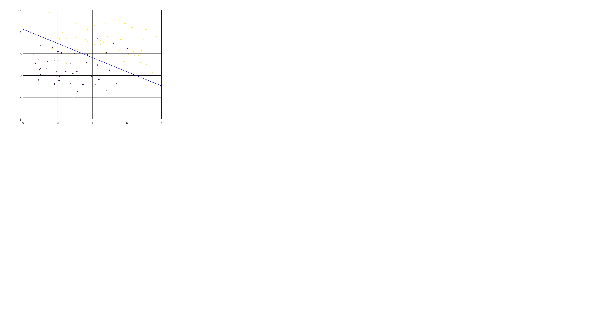

## 生成学习算法

之前我们是对$p(y|(x,\tau))\backsim D(\tau(x))$ 进行建模。就是要预测$y$在不同类别上的概率分布，进而确定$y$的种类。

现在我们换一种思路，利用贝叶斯的后验概率。在一个学校男的都穿裤子，女的一半穿裤子，一半穿裙子。如果我们有男女比例的数据，例如男:女＝6:4。那么我只看下半身发现对面的同学穿了裤子，那他是男的还是女的呢？也就是我们先认识一下不同类的分布的自身属性，在反过来研究我们要预测的对象。我们用这种思路重新审视这个问题。在分类问题中，我们的样本给我们提供了一个男女的比率数据，但是这个数据的真实性（即能不能代表全样本空间的分布）可能不会太好（例如有隔壁学校蹭课的同学，被你看见了）。

### GDA(连续特征)

分布的假设：

$\Omega=\Omega_1+\Omega_2+...+\Omega_k,\Omega_i\cap\Omega_j=\emptyset(i\ne j)$

#### 1 $y\backsim Bernoulli(\phi)$

#### 2 $x|y\in \Omega_i \backsim N(\mu_i,\Sigma)$ 

$p(y)=\prod_{i=1}^{i=k}\phi_i^{is(y\in\Omega_i)}$

$f(x|y\in\Omega_i)=\frac{1}{(2\pi)^{\frac{n}{2}}|\Sigma|^{\frac{1}{2}}}e^{-\frac{1}{2}(x-\mu_i)^T\Sigma^{-1}(x-\mu_i)}$

$f(x|y)=\prod_{i=1}^{i=k}(\frac{1}{(2\pi)^{\frac{n}{2}}|\Sigma|^{\frac{1}{2}}}e^{-\frac{1}{2}(x-\mu_i)^T\Sigma^{-1}(x-\mu_i)})^{is(y\in\Omega_i)}$

由条件概率公式：

$p(y|x)=\frac{p(x|y)p(y)}{p(x)}$

由全概率公式：

$p(x)=\sum_{i=1}^{i=k}p(y\in\Omega_i)f(x|y\in\Omega_i)=\sum_{i=1}^{i=k}\phi_i\frac{1}{(2\pi)^{\frac{n}{2}}|\Sigma|^{\frac{1}{2}}}e^{-\frac{1}{2}(x-\mu_i)^T\Sigma^{-1}(x-\mu_i)}$

得到贝叶斯公式：

$p(y\in\Omega_i|x)=\frac{p(x|y\in\Omega_i)p(y\in\Omega_i)}{\sum_{i=1}^{i=k}p(y\in\Omega_i)p(x|y\in\Omega_i)}$

可以看出我们对于一个给的样本属性$x$判断它的分类的时候一定是挑在$x$发生下所有分类贡献中最大的那一个。即$p(x|y\in\Omega_i)p(y\in\Omega_i)$最大对应的分类(原文中的想法),但是$p(x)$本身也是$\phi,\mu,\Sigma$函数。

这个时候$L(\phi,\mu_1,..,\mu_k,\Sigma)=\prod_{i=1}^{i=m}p(y^i\and x^i)=\prod_{i=1}^{i=m}p(x^i|y^i)p(y^i)$,$l(\phi,\mu_1,..,\mu_k,\Sigma)=\sum_{i=1}^{i=m}(\ln(p(x^i|y^i))+\ln p(y^i)$

$ln(y)=\sum_{i=1}^{i=k}{is(y\in\Omega_i)ln(\phi_i)}$

$\ln p(x|y)=\sum_{i=1}^{i=k}{is(y\in\Omega_i)ln(\frac{1}{(2\pi)^{\frac{n}{2}}|\Sigma|^{\frac{1}{2}}}e^{-\frac{1}{2}(x-\mu_i)^T\Sigma^{-1}(x-\mu_i)})}$

$l(\phi,\mu_1,..,\mu_k,\Sigma)=\sum_{j=1}^{j=m}\sum_{i=1}^{i=k}{is(y^j\in\Omega_i)(ln(\frac{1}{(2\pi)^{\frac{n}{2}}|\Sigma|^{\frac{1}{2}}}e^{-\frac{1}{2}(x-\mu_i)^T\Sigma^{-1}(x-\mu_i)})}+\sum_{j=1}^{j=m}(\sum_{i=1}^{i=k-1}is(y^j\in\Omega_i)\ln\phi_i+is(y^j\in\Omega_k)\ln(1-\sum_{l=1}^{l=k-1}\phi_l))$

#### 1  $\phi$

$\frac{\partial l}{\partial \phi_i}=\sum_{j=1}^{j=m}(\sum_{i=1}^{i=k-1}is(y^j\in\Omega_i)\frac{1}{\phi_i}-is(y^j\in\Omega_k)\frac{1}{1-\sum_{l=1}^{l=k-1}\phi_l})=0$

即选择的$m$个样本中属于不同分类的个数分别为$m_1,m_2,...,m_k,m_i\ge0, \sum m_i=m$

上式等价于$\frac{m_i}{\phi_i}=\frac{m_k}{\phi_k},i=1,2,..,k$

由比例式形式$\phi_i=\frac{m_i}{m},i=1,2,...,k$

#### 2 $\mu_i$

$\frac{\partial l}{\partial \mu_i }=\frac{\sum_{j=1}^{j=m}\sum_{i=1}^{i=k}{is(y^j\in\Omega_i)\partial (-\frac{1}{2}(x^j-\mu_i)^T\Sigma^{-1}(x^j-\mu_i))}}{\partial \mu_i}=\sum_{j=1}^{j=m}\sum_{i=1}^{i=k}is(y^j\in\Omega_i)\Sigma^{-1}(x^j-\mu_i)=0$

$\Sigma^{-1}\sum_{j=1}^{j=m}\sum_{i=1}^{i=k}is(y^j\in\Omega_i)(x^j-\mu_i)=\Sigma^{-1}(\sum_{j=1}^{j=m}\sum_{i=1}^{i=k}is(y^j\in\Omega_i)x^j-m_i\mu_i)=0$

$\Sigma$正定,则$\mu_i=\frac{\sum_{j=1}^{j=m}\sum_{i=1}^{i=k}is(y^j\in\Omega_i)x^j}{m_i}$。

#### 3 $\Sigma$

[matrix calculus](http://www.psi.toronto.edu/matrix/calculus.html)

$\frac{d (ln\det(X^k))}{dX}=kX^{-T}$

$\frac{d (a^TXb)}{dX}=ab^T$

$\frac{\partial l}{\partial \Sigma}=-\frac{\sum_{j=1}^{j=m}\sum_{i=1}^{i=k} is(y^j\in\Omega_i)\partial\ln(2\pi)^{\frac{n}{2}} |\Sigma|^{\frac{1}{2}}}{\partial \Sigma}-\frac{1}{2}\frac{\sum_{j=1}^{j=m}\sum_{i=1}^{i=k} is(y^j\in\Omega_i)\partial (x^j-u_i)^T\Sigma^{-1}(x^j-u_i)}{\partial \Sigma}=0$

$-\sum_{j=1}^{j=m}\sum_{i=1}^{i=k} is(y^j\in\Omega_i)\frac{1}{2}  \Sigma^{-1}+\Sigma^{-2}\frac{1}{2}\sum_{j=1}^{j=m}\sum_{i=1}^{i=k} is(y^j\in\Omega_i)(x^j-u_i)(x^j-u_i)^T=0$

$m\Sigma^{-1}=\Sigma^{-2}\sum_{j=1}^{j=m}\sum_{i=1}^{i=k} is(y^j\in\Omega_i)(x^j-u_i)(x^j-u_i)^T$

$\Sigma=\frac{\sum_{j=1}^{j=m}\sum_{i=1}^{i=k} is(y^j\in\Omega_i)(x^j-u_i)(x^j-u_i)^T}{m}$

#### 4 $Hessian(l)$半正定

### GDA模型的物理意义和缺陷

根据上述方法，我们可以得出不同分类本身的分布属性，对于给定的一个预测样本$\{x,y\}$,根据贝叶斯的后验概率原理，我们只需要将造成$x$发生可能性最大的分类$y$为其预测结果即可。也就是发现一个同学穿裤子，男女比例$6:4$ ,穿裤子男女比例$6:2$,显然觉得看见的同学是一个男生比较靠谱。

$GDA$需要样本在不同分类上的特征都能表达为一个多元高斯分布，这在实践中验证这一假设比较困难，而且还假设这些分布的方差矩阵一致，这个假设非常强！！！

不过直观感受，这个方法比$GLM$靠谱。

### Naive Bayes（离散特征）

回到开始的问题利用$Bayes$的想法建立一个预测模型即：

$\prod_{i=1}^{i=m}p(y^i\and x^i)=\prod_{i=1}^{i=m}p(y^i)p(x^i|y^i)$

从$GDA$受到启发$p(y)$总是可以通过样本学习得到一个很好的估计(如果样本足够巨大，按照大数定理，能够保障估计的可靠性)。关键问题是如何对$p(x|y)$建模。如果$x$是一个维度非常巨大的特征向量，$p(x_1,x_2,....,x_n|y),n \to \infty$ 无论我们采取何种分布建立模型，模型的参数和计算量，无疑非常巨大。$Bayes$假设认为对于给定的分类而言，特征独立:

$p(x_1,x_2,....,x_n|y)=p(x_1|y)p(x_2|y,x_1)...p(x_n|y,x_1,x_2,...,x_{n-1})=p(x_1|y)p(x_2|y)...p(x_n|y)=\prod_{i=1}^{i=n}p(x_i|y)$

这样极大的简化了模型的建立和计算。但是对于高度相关的特征情况，这个模型不能使用。

对于离散的特征情况，我们可以简化估计的模型，估计$\phi_i=p(y\in\Omega_i),\phi_{ij}=p(x_j|y\in\Omega_i)$,$l(\phi_i,\phi_{ij})=\sum_{i=1}^{i=m}\ln p(y^i)+\sum_{i=1}^{i=m}\ln p(x^i|y^i)=\sum_{i=1}^{i=m}\ln p(y^i)+\sum_{i=1}^{i=m}\sum_{j=1}^{j=n}\ln p(x_j^i|y^i) $

显然$\phi_i$的估计和$GDA$是一致的，$\phi_{ij}$估计相类似。预测依旧选择贡献最大的分类。

### 注意

离散　插值　－> 　连续

连续　分段　－>　 离散

### 改进$Naive Bayes$ =>$lapace$光滑

克服对未知事件的一个过低估计

### 多项式事件模型

想法：对于一个给定的字典，我们假设字典中的单词是一个多项式分布，在这个假设下使用$Naive\  Bayes$来进行最大似然参数估计。

## 支持向量机

#### 引入：再看$Logistic$回归

$h_\theta(x)=\frac{1}{1+e^{-\theta^Tx+b}}$,从一般线性模型($GLM$)可以看出，这是我们在假设对给定特征以后，类别分布服从$Bernoulli$分布的线性模型下的概率分布预测。即$h_\theta(x)>0$且越大，我们越有信心预测它是正样例。如果$h_\theta(x)<0$且越小，我们越有信心预测它是反样例。实际上，$Logistic$回归可以看成是在一个样本空间中寻找一个超平面分割开不同类型的样本(对于$h_\theta(x),R^n\to R$的情况)。从这个角度进行推广，

#####1 我们在特征空间如何确定一个超平面分割样本类型

#####2 如何评估这个超平面的好坏情况

